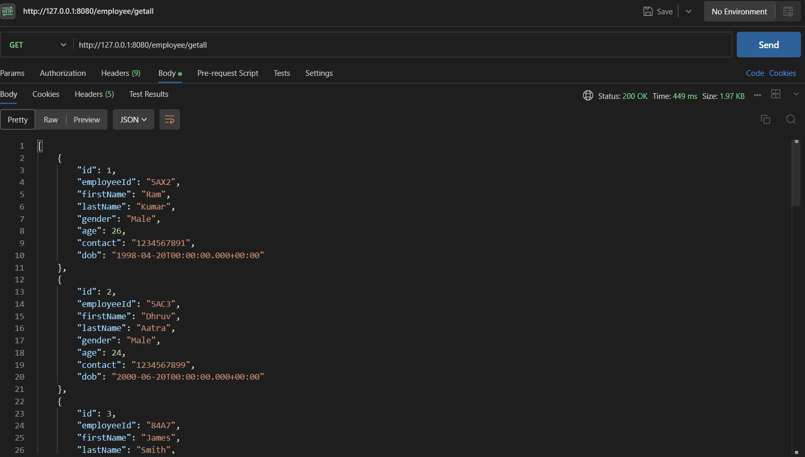
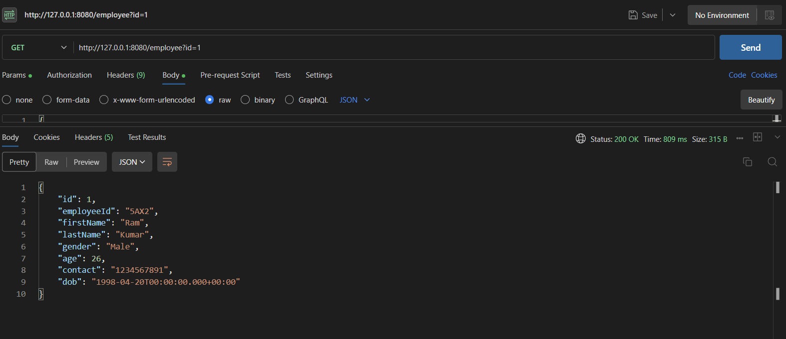
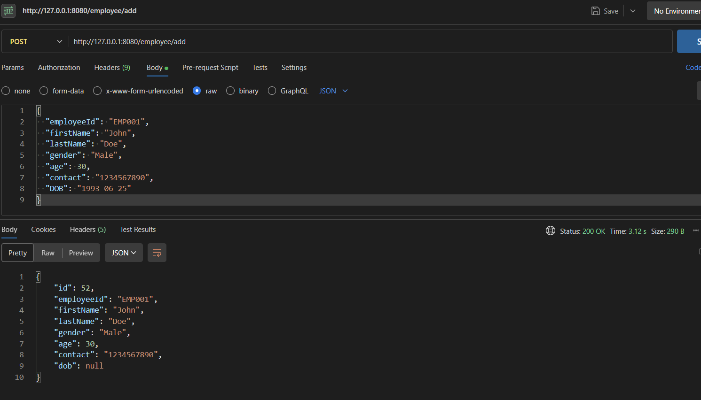
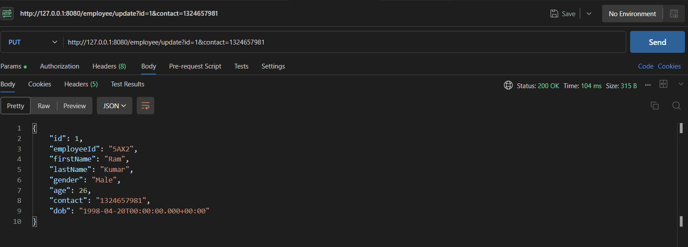
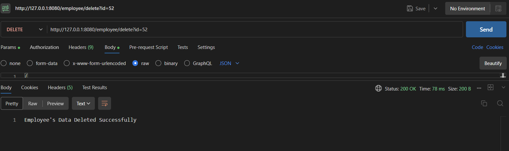

# Employee Management System
This is a springboot application with an SQL Server for managing employee detail. It facilitates in adding , retrieving , updating as well as deleting employee records using the VS Code IDE.It also provides RESTful API to perfrom various functionalities as seen in the 
API Endpoints.

## Getting Started : 

- Install the MySQL installer - [here](https://dev.mysql.com/downloads/installer/)
- Install the MySQL Workbench - [here](https://dev.mysql.com/downloads/workbench/)
- Make sure you have installed the Java Extension Pack as well as Spring Boot Extension Pack in VS Code or download it - [here](https://code.visualstudio.com/docs/java/extensions)

## Setup : 
- Make sure to configure your database in ```resources/application.properties``` :
```bash
spring.application.name=sql
spring.datasource.url = jdbc:mysql://localhost:3306/<your_database_name>
spring.datasource.username = <your_username>
spring.datasource.password= 
spring.datasource.driver-class-name=com.mysql.jdbc.Driver
spring.jpa.database-platform=org.hibernate.dialect.MySQL8Dialect

# auto updation.
spring.jpa.hibernate.ddl-auto=update
spring.jpa.show-sql=true
spring.jpa.properties.hibernate.format_sql=true

server.port = 8080
```
- Make sure to check the POX.XML after setting up the project.
- Setup MySQL workbench by reffering to yt videos or [docs](https://dev.mysql.com/doc/workbench/en/wb-installing.html)

## API Endpoints

- **GET - ```/employee/getall```**

  Gets all the users !

  

- **GET - ```/employee?id=```**

  To get the employee by Id(primary key)

  

- **POST - ```/employee/add```**
  
   To add employee's data in the database by POST functionality.

  

- **PUT -```/employee/update/<queries>```**

  To update any information about the user , query in the changes. Example : ```www.localhost:8080/employee/id=1?&contact=1234567891```

  

- **DELETE -```/employee/delete?id=```**

   To delete the user by their unique ID in db.

  


## SQL WorkBench Console : 

